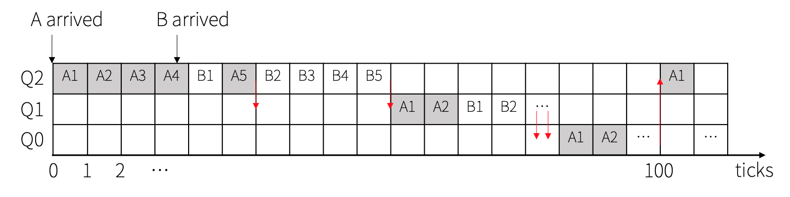

# Milestone1 (Step 1)

## 1) Assignment Summary
### What to do
Design a MLFQ (MultiLevel Feedback Queue) scheduler.
### MLFQ Requirements
```
• 3-level feedback queue
• Each level of queue adopts a Round Robin policy with different time quantum
• Each queue has a different time allotment
• To prevent starvation, priority boost is required
```
### MLFQ Scheduler Details
```
• MLFQ consists of three queues with each queue applying the round robin scheduling.
• The scheduler chooses the next process that’s ready from the MLFQ. If any process is
  found in the higher priority queue, a process in the lower queue cannot be selected
  until the upper level queue becomes empty.
• Each level adopts the Round Robin policy with a different time quantum.
  - The highest priority queue: 1tick
  – Middle priority queue: 2ticks
  – The lowest priority queue: 4ticks
• Each queue has a different time allotment.
  – The highest priority queue: 5ticks
  – Middle priority queue: 10ticks
• To prevent starvation, priority boosting needs to be performed periodically.
  – Priority boosting is the only way to move the process upward.
  – Frequency of priority boosting: 100 ticks of MLFQ scheduling
• MLFQ should always occupy at least 20% of the CPU share.
```

### Required system calls
```
• yield: yield the cpu to the next process
  – int sys_yield(void): wrapper
  – int yield(void): systemcall
  – Return 0.
  – Gaming the scheduler:
      We will forbid this by incrementing a tick for the process in such cases.
• getlev: get the level of the current process in the MLFQ.
  – int sys_getlev(void): wrapper
  – int getlev(void): system call
  – Return one of the levels of MLFQ (0/1/2), otherwise a negative number.
```

## 2) My Design
### Process structure
Below is the original process table,
```cpp
struct {
  struct spinlock lock;
  struct proc proc[NPROC];
} ptable;
```
and the original process control block (PCB).
```cpp
struct proc {
  uint sz;                     // Size of process memory (bytes)
  pde_t* pgdir;                // Page table
  char *kstack;                // Bottom of kernel stack for this process
  enum procstate state;        // Process state
  int pid;                     // Process ID
  struct proc *parent;         // Parent process
  struct trapframe *tf;        // Trap frame for current syscall
  struct context *context;     // swtch() here to run process
  void *chan;                  // If non-zero, sleeping on chan
  int killed;                  // If non-zero, have been killed
  struct file *ofile[NOFILE];  // Open files
  struct inode *cwd;           // Current directory
  char name[16];               // Process name (debugging)
};
```
- **ptable**

Below is the modified code of ptable.
```cpp
struct queue {
  struct proc *head;
  struct proc *tail;
}
struct {
  struct spinlock lock;
  struct proc proc[NPROC];
  struct queue queue[3];
} ptable;
```
I added 3 queues to ptable and maintain original proc[NPROC].
Each queue points the first and last PCBs of each level. 
If the queue is filled with `NULL`, then we regard it as an empty queue.

- **PCB**

Below is the modified code of PCB.
```cpp
struct proc {
  uint sz;                     // Size of process memory (bytes)
  pde_t* pgdir;                // Page table
  char *kstack;                // Bottom of kernel stack for this process
  enum procstate state;        // Process state
  int pid;                     // Process ID
  struct proc *parent;         // Parent process
  struct trapframe *tf;        // Trap frame for current syscall
  struct context *context;     // swtch() here to run process
  void *chan;                  // If non-zero, sleeping on chan
  int killed;                  // If non-zero, have been killed
  struct file *ofile[NOFILE];  // Open files
  struct inode *cwd;           // Current directory
  char name[16];               // Process name (debugging)
  // Added Lines
  uint ticks;
  uint privlevel;
  struct proc *prev;
  struct proc *next;
};
```
`ticks` is the local ticks of the process.
And `privlevel` means the privilege level of the queue where the process exists.
If the process is in the highest queue, it will be 2.

And every PCB has `prev` and `next` fields.
`prev` points the previous PCB on the same level.
And `next` points the next PCB on the same level.

Then they constitute the **doubly linked list**.

In this queue, `RUNNING` and `RUNNABLE` processes exist. When a process sleeps,
it keeps the level in `privlevel`.

I named this queue **RUN queue**.


### Process CRUD
I looked at MLFQ from the point of view of process CRUD in queues.

**1. CREATE (push queue)**

When we create a process in MLFQ, we need an additional part which push the new process to a queue. And from the MLFQ **rule 3** (*When a job enters the system, it is placed at the highest priority*), the new process must be pushed in the highest level queue `ptable.queue[2]`.

And pushing to the queue occurs when the process state changes from `SLEEPING` to `RUNNABLE`.

* Time complexity: **O(1)**

The algorithm is as follows.
```
p := {process to push}
n := {target level}
prev = queue[n].tail
prev->next = p
p->prev = p
p->privlevel = n
queue[n].tail = p
```

No matter how many processes there are, it takes same time.

**2. READ (select next process)**

The main purpose of scheduler is scheduling processes.
After a process yields to `cpu->scheduler`, then `cpu->scheduler` select (READ) a `RUNNABLE` process. When select a process, the scheduler must meet the **rule 1** (*If Priority(A) > Priority(B), A runs (B doesn’t)*), and **rule 2** (*If Priority(A) = Priority(B), A & B run in RR*).

* Time complexity: **O(1)**
The algorithm at the single core case is as follows.
```
p := {just yielded process}
if p->privlevel == 2:
  if p->next, then select p->next
  if queue[2].head, then select queue[2].head
  if queue[1].head, then select queue[1].head
  if queue[0].head, then select queue[0].head
if p->privlevel == 1:
  if queue[2].head, then select queue[2].head
  if p->next, then select p->next
  if queue[1].head, then select queue[1].head
  if queue[0].head, then select queue[0].head
if p->privlevel == 0:
  if queue[2].head, then select queue[2].head
  if queue[1].head, then select queue[1].head
  if p->next, then select p->next
  if queue[0].head, then select queue[0].head

```
Search operation time complexity of original doubly linked list is `O(n)` in both worst and average case.
But in this scheduling case, the entry point of searching is not the first element.
When the scheduler occupies the cpu again and again, it restarts from the middle.
And remind that the most states in queues are `RUNNABLE`. 

So it checks just each head of queues and next process. 
It is very tricky and awesome point of this queue.

Even if at the multicore case, the time doesn't depend on the number of process. The time complexity at the multicore is O(m) (m is the number of cores). If next process state is `RUNNING`, the scheduler have to check the next after next process. In the worst case, there can be m-1 `RUNNING` processes in a row. But m is way smaller than the number of entire processes. Nowadays the number of cores of commercialized CPUs is 64 or less. And most of them is under 16. But the max number of processes in a linux is more than 10000. So this READ operation can be considered reasonable. 

**3. UPDATE (queue jump)**

Keep in mind the **rule 4** (*Once a job uses up its time allotment at a given level (regardless of how many times it has given up the CPU), its priority is reduced(i.e., it moves down on queue)*), and **rule 5** (*After some time period S, move all the jobs in the system to the topmost queue*). And this assignment says that we will forbid gaming the scheduler by incrementing a tick for the process.

So, if a process yield, `ticks` of the process increases by 1. It prevents gaming the scheduler. In addition to yield, when a process sleep, `ticks` increases.
After the scheduler occupies the cpu, it checks `ticks`. If the process used up its time allotment, its priority is reduced. And it checks global `ticks`, then if it fulfilled the interval of the priority boost, all processes are move to the highest queue. 

* Time complexity

Below is the priority reducing algorithm.
```
p := {just yielded process}
if p->privlevel == 2:
  p->privlevel = 1
  if p->state == RUNNABLE:
    p->prev->next = p->next
    p->next->prev = p->prev
    p->prev = queue[1].tail
    p->next = NULL
    queue[1].tail->next = p
    queue[1].tail = p
if p->privlevel == 1:
  p->privlevel = 0
  if p->state == RUNNABLE:
    p->prev->next = p->next
    p->next->prev = p->prev
    p->prev = queue[0].tail
    p->next = NULL
    queue[0].tail->next = p
    queue[0].tail = p
```
Always it takes same time, so the time complexity of this algorithm is **O(1)**.
And the algorithm of the priority boost is as follows:
```
for p in ptable.proc:
  p->privlevel = 2
queue[2].tail->next = queue[1].head
queue[1].head->prev = queue[2].tail
queue[1].tail->next = queue[0].head
queue[0].head->prev = queue[1].tail
queue[2].tail = queue[0].tail
queue[1].head = queue[1].tail = NULL
queue[0].head = queue[0].tail = NULL
```
Because of the `for` loop, this time complexity is **O(n)**. n means the number of processes. It is a bad point of this design. But because the priority boost doesn't occur frequently, this will be ok.

**4. DELETE (pop queue)**

Deletion of a process from the queue occurs when the state of the process changes from `RUNNING` or `RUNNABLE` to another. Its privilege level remains the same in `privlevel`.

* Time complexity: **O(1)**
```
p->prev->next = p->next
p->next->prev = p->prev
p->prev = p->next = NULL
```
It takes the constant time.

### Criteria

I was debating between 2 options. The first was the RUN queue. And the second was the ALL STATE queue.
The first option has already been explained above. The other is the queue which has every state except `UNUSED` state.

| operation | RUN queue | ALL STATE queue |
| --- | --- | --- |
| CREATE | execute when fork or wakeup | execute only when fork |
| READ | O(m) | O(n) |
| UPDATE (decrease) | O(1) | O(1) |
| UPDATE (boost) | O(n) | O(1) | 
| DELETE | execute when exit or sleep | execute only when exit |

(n: the number of processes, m: the number of cores)

In ALL STATE queue, if every state of processes except the lowest and tail process is `SLEEPING` and the last process is `RUNNABLE`, then the time complexity of READ can be O(n). If there are few `SLEEPING` processes, ALL STATE queue can be better than the first option. Because the chances of meeting a `SLEEPING` process is low and the average time complexity can be O(1).

But in many cases, there are a lots of `SLEEPING` states. In my environment, there are 2% `RUN` state processes and 62% `SLEEPING` state processes. And according to [Computer Organization and Design: The Hardware/Software Interface](https://books.google.co.kr/books?id=DMxe9AI4-9gC&pg=PA52&lpg=PA52&dq=Fallacy:+Low+Power+at+Idle&source=bl&ots=w0LlS_cLiI&sig=ACfU3U0HSoxDLz9plSxVrb5W-IYMlK9cZA&hl=ko&sa=X&ved=2ahUKEwikrtGmn_j2AhXuyIsBHSxqAFgQ6AF6BAg2EAM#v=onepage&q=Fallacy%3A%20Low%20Power%20at%20Idle&f=false), cpu utilization for servers at Google is between 10% and 50% most of the time. That is, the most states are `SLEEPING` states.

So I chose **the RUN queue** option. Even though the time complexity of the priority boost is O(n), it's okay because it occurs infrequently. But in the future, I will consider how to reduce the time complexity of the operation.