# Process Life Cycle
## xv6 Process States
I regarded the process as a **state machine**. In xv6, the machine can have 6 states: UNUSED, EMYRO, RUNNABLE, RUNNING, SLEEPING and ZOMBIE. And there are a several transition function which changes the state. Below is the graph of this state machine.
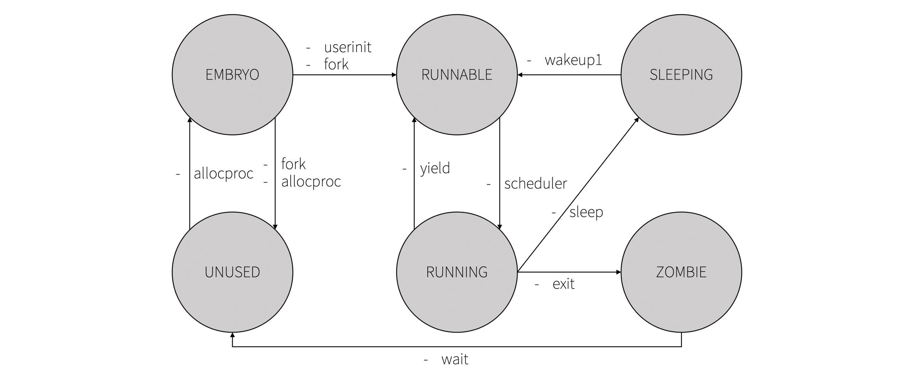
## State Transition Functions
Each transition has own state change and the time complexity. The input size N of time complexity is the number of processes. It depends on `NPROC` in param.h.
### allocproc
```
Transition     : UNUSED -> EMBRYO
Time complexity: O(N)
Exception      : EMBRYO -> UNUSED
```
### userinit
```
Transition     : EMBRYO
Time complexity: O(1)
```
### fork
```
Transition     : EMBRYO -> RUNNABLE
Time complexity: O(N)
Exception      : EMBRYO -> UNUSED
```
### yield
```
Transition     : RUNNING -> RUNNABLE
Time complexity: O(1)
```
### sleep
```
Transition     : RUNNING -> SLEEPING
Time complexity: O(1)
```
### exit
```
Transition     : RUNNING -> ZOMBIE
Time complexity: O(N^2)
```
### wakeup1
```
Transition     : SLEEPING -> RUNNABLE
Time complexity: O(N)
```
### wait
```
Transition     : ZOMBIE -> UNUSED
Time complexity: O(N)
```
### scheduler
```
Transition     : RUNNABLE -> RUNNING
Time complexity: O(N)
```

## How to Reduce Time Complexity
Original xv6 searches all processes in the process table when calling transition functions. But each function doesn't need to search all. For example, `allocproc` needs to search only `UNUSED` state. It is the key point to reduce time complexity. I came up with 2 features. First is the parental rights. Parents must not leave their children unattended. Let the parent processes know their children. And next is the doubly linked list queue. In this queue, nodes can know their prev and next in constant time. Let's see the following.
### Parental Rights
In `exit` and `wait`, a current process finds its children. To find them, it searches all processes. It is very inefficient. It is because the parent doesn't know its children. In `struct proc`, there is just a `parent` field. So I added children fields.
```c
struct proc {
  ...
  struct proc *parent;         // Parent process
  struct proc *sibling;
  struct proc *ochild;         // Oldest child process
  struct proc *ychild;         // Youngest child process
  ...
};
```
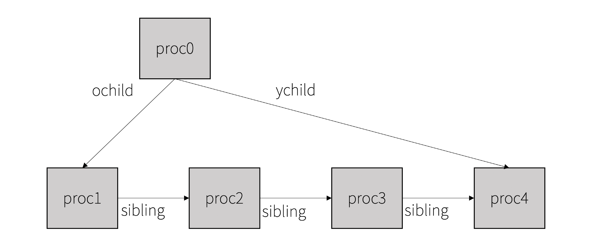

I construct the children as the **singly linked list**. Now a parent can check only children. Following is searching children algorithm.
```c
for(struct proc *p = parent->ochild; p != 0; p = p->sibling){
  dosomething();
}
```

### Doubly Linked List Queue
If a queue has only one state, it can be possible to search just one state. And time complexity of push and pop is O(1).

```c
struct queue {
  struct proc *head;
  struct proc *tail;
};
struct proc {
  ...
  struct proc *prev;
  struct proc *next;
};
```
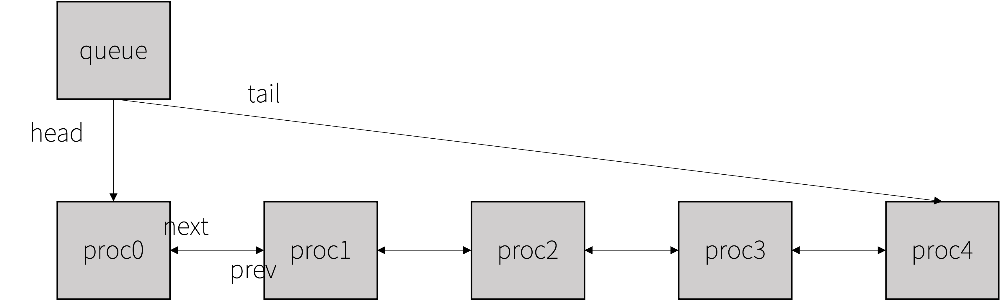

For example, let's think the case that all but last processes are using. To find a `UNUSED` process, original xv6 searches it from the first process until there is the unused; the last process. It takes N times to search. But if we use doubly linked list, it is sufficient just to pop a head or tail. It takes constant time. It makes `allocproc` O(1). Then it affects `fork`; O(1).

And if we manage sleeping states in this queue, all we have to do is searching just sleeping processes. Then it makes `wakeup1` to take less time.

## Scheduler
We reduced time complexity of transition functions; `allocproc`, `fork`, `exit`, `wakeup1`, `wait`. But `scheduler` remained. It's time to enhance it. Look at the below.

# Stride with MLFQ Scheduler
## Ticket Dispenser

MLFQ is the ticket dispenser in the stride scheduler. The total tickets of this scheduler is 100. Each process which obtained a cpu share has tickets. Like these processes, MLFQ has tickets too. But it has the remaining tickets. And it must have a certain reserve in stock. The number of remaining tickets must be 20 or more.

For example, process 1 has 10 tickets and process 2 has 15 tickets. Then MLFQ has 75 tickets. In this example, if process 3 arrived and requested 8 tickets, then MLFQ gives 8 tickets to process 3. Now MLFQ has 67 tickets. If MLFQ continues to give out tickets and the number reaches at 20, then it refuses to give out tickets.

If a stride process finished, then it has to return its tickets to the dispenser.

## Data Structures
### Stride and MLFQ structure
MLFQ has tickets and pass like the stride processes. And it has 3 queues and 3 pins. MLFQ has 3 different level queues. MLFQ processes travels between the queues according to MLFQ rules.

And stride has [minheap](#stride-minheap) and [run queue](#stride-queue). The size field of stride is the size of minheap.
```c
struct mlfq {
  // Stride fields
  int tickets;
  int pass;
  // MLFQ fields
  struct queue queue[QSIZE];
  struct proc* pin[QSIZE];
};
struct stride {
  int size;
  struct proc* minheap[NPROC+1];
  struct queue run;
};
```
### Process Control Block
Each process has a type. The type is mlfq or stride. Initial type of process is mlfq. And if it calls `set_cpu_share` systemcall, then it becomes stride. If it is mlfq, it uses ticks and privlevel fields. Else if stride, it uses tickets and pass.
```c
enum schedtype { MLFQ, STRIDE };
struct proc {
  ...
  enum schedtype type;
  // Stride fields
  int tickets;
  int pass;
  // MLFQ fields
  uint ticks;
  int privlevel;
  ...
}
```
### Stride Minheap
To get a process which has the minimal pass value, I needed new data structure. So I chose **Min Heap**. When the scheduler select next process, pop occurs. After running, it has to push the pass-updated process again. Pop of minheap takes constant time and push takes logN times.

And the scheduler selects a next runnable process. If minheap doesn't manage a sleeping process, the monopoly problem can occurs. If the pass of a sleeping process doesn't increase, then after waking up the process can monopolize the scheduler. So minheap has to include sleeping processes too.
```
Nodes states: RUNNABLE, SLEEPING
Time complexity
  - push: O(logN)
  - pop : O(logN)
```
### Stride Queue
We reuse [doubly linked list queue](#doubly-linked-list-queue). To prevent [pass overflow](#pass-overflow), it needs to use the stride queue which includes running processes.
```
Nodes states: RUNNING
Time complexity:
  - push      : O(1)
  - pop       : O(1)
  - search all: O(m)
```
m is the number of cores.
### MLFQ Queue
To select next process in MLfQ, I designed queues of MLFQ to include RUNNABLE and RUNNING states. And these queues follow the doubly linked list too. When selecting next process, the scheduler searches the next process of current process. If the next process is running, then it searches next of the next. The maximum number of running processes is same with the number of cores minus 1. So selecting takes O(m) times.
```
Nodes states: RUNNABLE, RUNNING
Time complexity:
  - select: O(m)
  - push  : O(1)
  - pop   : O(1)
```
### Free Queue
As explained above, this queue accelerates finding a `UNUSED`. To be honest, it is sufficient to use singly linked list. But to keep regularity and reuse the same queue, I designed it to use the doubly linked list again.
```
Nodes states: UNUSED
Time complexity:
  - push: O(1)
  - pop : O(1)
```
### Sleep Queue
The advantage of using this sleep queue is that we doesn't need to search all processes to find sleeping processes. When a sleeping process wakes up, it just needs to link the previous sleeping process and next sleeping process. Waking up takes constant time. However, searching a process which will wake up takes N times.

If using the different sleeping queues for each channel, there will be a performance improvement. But this version uses one unified sleeping queue. It is a supplement point.
```
Nodes states: SLEEPING
Time complexity:
  - push  : O(1)
  - pop   : O(1)
  - search: O(N)
```
## Stride Algorithm
The algorithm of stride scheduler consists of 3 steps. Select a next process which has a minimum pass value. Then run the selected. After running, increase the pass value as much as the stride value.
### 1) Select Next
```c
if(strideminpass < mlfqpass){
  p = popheap();
} else {
  p = mlfqselect();
}
```
First the scheduler compares the pass of mlfq with the minimum pass of minheap. If minheap's pass is lower than mlfq's, the process which has the minimum pass in stride minheap is selected. Otherwise, a process in mlfq is selected. There are 4 cases:
1. Runnable stride process
2. Sleeping stride process
3. Runnable mlfq process
4. Not selected

Case 4 happens if there isn't any process in stride minheap and all processes in mlfq are sleeping.

### 2) Run Process
```c
if(p != 0 && p->state == RUNNABLE) {
  if(p->type == STRIDE)
    pushqueue(STRIDEQ, p);

  c->proc = p;
  switchuvm(p);
  p->state = RUNNING;

  swtch(&(c->scheduler), p->context);
  switchkvm();

  if(p->type == MLFQ){
    mlfqlogic(p);
  }
  c->proc = 0;
}
```
Only runnable process can become running. So case 1 and case 3 can enter into this step. At case 1, pushing it to stride run queue is required. At case 3, after running it needs to be handled according to mlfq rules.
### 3) Log stride
```c
if(p == 0 || p->type == MLFQ){
  ptable.mlfq.pass += STRD(ptable.mlfq.tickets);
} else if(p->type == STRIDE){
  if(p->state == RUNNABLE || p->state == SLEEPING){
    p->pass += STRD(p->tickets);
    pushheap(p);
 }
}
```
This is main key point of the stride scheduling. After running, the pass needs to increase by the stride for [each case](#1\-select-next).

- case 1) The pass of process increases by the stride.

- case 2) The pass of process needs to increase to prevent the monopoly.

- case 3) The pass of mlfq needs to increase.

- case 4) The pass of mlfq needs to increase to prevent the monopoly.

At case 4, if the pass of mlfq doesn't increase, then rearrived stride process cannot be selected. For example, let the pass of mlfq be 1000 and the minimum pass of stride minheap be 1200. In this case, if all processes in mlfq are sleeping, the mlfq monopolizes the scheduler until a process in mlfq wakes up. There must be at least one process in mlfq; `initproc`. So it is similar to case 2.

## MLFQ Algorithm
### The refined set of MLFQ rules
- Rule 1: If Priority(A) > Priority(B), A runs (B doesn’t).
- Rule 2: If Priority(A) = Priority(B), A & B run in RR.
- Rule 3: When a job enters the system, it is placed at the highest priority.
- Rule 4: Once a job uses up its time allotment at a given level (regardless of how many times it has given up the CPU), its priority is reduced(i.e., it moves down on queue).
- Rule 5: After some time period S, move all the jobs in the system to the topmost queue.

Rule 3 is satisfied if the level of new process is highest. I designed 0 as highest, 2 as lowest. `ptable` is initialized as 0 because it is a global variable in BSS. PCBs are in `ptable`. So the initial level is set as 0. And when a process became unused from zombie, the level of process is set as 0. So these 2 things guarantee rule 3.

### Select MLFQ process
When the scheduler select a next process, it has to search the highest queue first according to rule 1. So it searches from the highest(0) to the lowest(2):

`for(l = 0; l <= baselevel; l++)`

Rule 2, in the same level, processes run in Round-Robin:

`for(p = queue.head; p != 0; p = p->next)`

But there is a possibility of the head monopoly in the loop started from queue.head. For example, there are 2 processes in 0 level queue. First turn, the scheduler selects the head of 0 queue. Then next turn, it selects the head again.

So I implemented the pin. Pin is the iterator of the queue. Each queue has one pin. The scheduler searches from the pin to the previous process of the pin.


Here, according to rule 1, 0 queue is selected. But in the queue, it starts from the pinned process. 

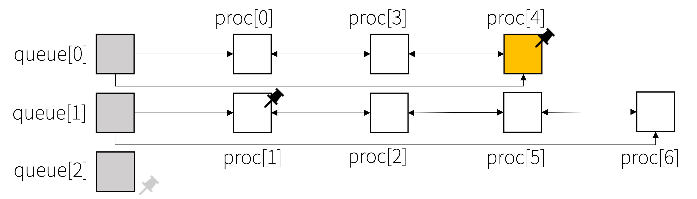

At next scheduling turn, it starts from the pinned again. Every turn, the pin moves. The movement of the pin is explained in the next section.
```c
struct proc*
mlfqselect(){
  struct proc *p;
  struct proc **ppin;
  int l, baselevel = NELEM(ptable.mlfq.queue)-1;

  for(l = 0; l <= baselevel; l++){
    ppin = &ptable.mlfq.pin[l];
    for(p = *ppin; p != 0; p = p->next){
      if(p->state == RUNNABLE){
        *ppin = p;
        return p;
      }
    }
    for(p = ptable.mlfq.queue[l].head; p != *ppin; p = p->next){
      if(p->state == RUNNABLE){
        *ppin = p;
        return p;
      }
    }
  }

  return 0;
}
```

### MLFQ logic
After a process running, the state of the process can be `RUNNABLE`, `SLEEPING` or `ZOMBIE`. MLFQ queue includes `RUNNABLE` and `RUNNING` states. So if the returned process is `RUNNABLE`, the process will exist in the queue. And if `SLEEPING` or `ZOMBIE`, then not exist. Let's think about each state separately.

1. `RUNNABLE`
```c
p->ticks++;
if(p->privlevel < baselevel && p->ticks % TA(p->privlevel) == 0){
  popqueue(p->privlevel, p);
  p->privlevel++;
  pushqueue(p->privlevel, p);
  p->ticks = 0;
} else if(p->ticks % TQ(p->privlevel) == 0){
  *ppin = p->next ? p->next : ptable.mlfq.queue[p->privlevel].head;
}
```
The returned runnable process increases its own ticks by 1. This means that both `yield` from timer interrupts and `yield` from systemcall make ticks up. This can prevent **gaming the scheduler** problem.

If the process used up its time allotment, it moves from its queue to lower queue. So push and pop queue are required. And according to the level, the time allotments are different.
```c
#define TA(l) (5*TQ(l))
```
If the process didn't use up its time quantum, the pin keeps its position. Then next turn, in `mlfqselect` the process is selected again. And according to the level, the time quantum are different.
```c
#define TQ(l) (l==0 ? 1 : 2*l)
```

2. `SLEEPING`
```c
if(p->privlevel < baselevel && p->ticks % TA(p->privlevel) == 0){
  p->privlevel++;
  p->ticks = 0;
} else {
  p->ticks = p->ticks / TQ(p->privlevel) * TQ(p->privlevel);
}
```
At sleeping state, I designed not to get ticks up. When I/O occurs, the process sleeps. If the ticks increases in this case, it is possible to move to the lower level queue. Then the response time can be longer. And think about `sleep` systemcall. After it is invoked, the timer interrupt wakes the process up every ticks. And if it doesn't fill the sleep time, this process sleeps again. That is, `sleep` occurs many transitions between `RUNNABLE` and `SLEEPING`. If it is designed to get ticks up, `sleep` systemcall will be a shortcut to the lowest priority queue. But it makes another problem. `sleep(0)` is similar to `yield`. But the ticks of the returned sleeping process doesn't increase. It can occur **gaming the scheduler** problem again. So I added `ticks++` to `sleep` systemcall, not to `sleep` in proc.c.
```c
int
sys_sleep(void)
{
  int n;
  uint ticks0;

  myproc()->ticks++;
  ...
}
```
A sleeping process doesn't exist in MLFQ queue. It keeps own level in 'privlevel' field. So when it used up its time allotment, it is sufficient to just modify the field. But think about the following example. A runnable process used up its time allotment, then it
went to lower level. Next turn, the scheduler selected the process again. Then it slept. After slept, MLFQ checked its ticks and time allotments. The ticks was 0.

`p->ticks % TA(p->privlevel) == 0`

This expression was true. So the process went to the lower queue again. It jumped twice. So at the sleeping case, this expression isn't suitable. So I modified the code to:

`p->ticks >= TA(p->privlevel)`

Now at the case ticks is 0, this problem doesn't occur.

If the process didn't use up its time allotment, its ticks should be rounded down in units of its time quantum. Otherwise, after it wakes up it can use only the fraction of its time quantum. For example, level 1 process is running. Then it yields. Then its ticks is set 1. Because it doesn't use up its time quantum, it runs again. In this running time, it sleeps. Its ticks is 1. After wakes up, it starts from 1 ticks. Then it can use only the fraction (remain 1 ticks) of the time quantum (2). For this reason, I made the ticks round down if the sleeping process doesn't use up its time quantum.

3. `ZOMBIE`

Zombie process cannot be selected. So there is nothing to do.

#### Priority Boost
Rule 4 is satisfied. Now to satisfy rule 5, it needs the priority boost. It consists of 2 parts. First is the boost of MLFQ queue and second is the boost of the sleeping queue. 
Both of them need to set the level as the highest level. Difference between them is linking. Concatenating each MLFQ queues makes them linked.

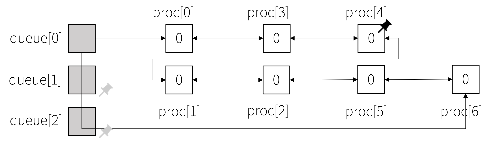
```c
void
mlfqlogic(struct proc* p){
  struct proc** ppin = &ptable.mlfq.pin[p->privlevel];
  struct proc* itr;
  int l, baselevel = NELEM(ptable.mlfq.queue)-1;

  switch(p->state){
    case RUNNABLE:
      logic_runnable(); // Look at 1. RUNNABLE
      break;
    case SLEEPING:
      logic_sleeping(); // Look at 2. SLEEPING
      break;
    case ZOMBIE:
      break;
    default:
      panic("mlfq wrong state");
  }
  // Priority boost
  if(ticks % BOOSTPERIOD == 0){
    // RUNNABLE, RUNNING
    for(l = 1; l <= baselevel; l++){
      for(itr = ptable.mlfq.queue[l].head; itr != 0; itr = itr->next){
        itr->privlevel = 0;
        itr->ticks = 0;
      }
      concatqueue(l, 0);
    }
    // SLEEPING
    for(itr = ptable.sleep.head; itr != 0; itr = itr->next){
      itr->privlevel = 0;
      itr->ticks = 0;
    }
  }
}
```

## Systemcalls
### set_cpu_share
The logic is described above; [ticket dispenser](#ticket-dispenser).
```c
int set_cpu_share(int share){
  struct proc *p;
  int remain;
  int minpass, mlfqpass;

  if(share < 1 || share > 100 - RESERVE)
    return -1;

  acquire(&ptable.lock);
  p = myproc();
  remain = ptable.mlfq.tickets;
  if(remain - share >= RESERVE){
    popqueue(p->privlevel, p);
    p->pass = 0;
    p->type = STRIDE;
    pushqueue(STRIDEQ, p);
    ptable.mlfq.tickets = remain - share;
    p->tickets = share;
    release(&ptable.lock);
    return 0;
  } else {
    release(&ptable.lock);
    return -1;
  }
}
```
## Scheduling Time Complexity
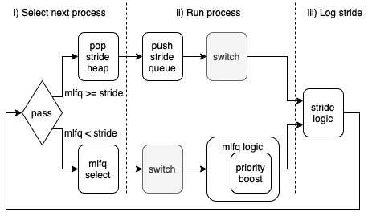
1. Stride type process
```
  i) Select next process
     - pass compare     : O(1)
     - pop stride heap  : O(logN)
 ii) Run process
     - push stride queue: O(1)
iii) Log stride
     - push stride heap : O(logN)
```
Time complexity of scheduling a stride type process is O(logN).

2. MLFQ type process
```
  i) Select next process
     - pass compare     : O(1)
     - mlfq select      : O(m)
 ii) Run process
     - mlfq logic
       - Normal case    : O(1)
       - Priority boost : O(N)
iii) Log stride
     - increase mlfqpass: O(1)
```
Time complexity of scheduling a stride type process is O(m + N). But m (the number of cores) is way smaller than N. And before 100th tick, it is O(m). So it is O(m) in the average case and O(N) in every 100 ticks (the worst case).

## Trouble Shooting
### Recall set_cpu_share
A stride process can call `set_cpu_share` again. In this case, the process returns own tickets to the ticket dispenser (mlfq). Then if the dispenser can give out newly requested tickets, it just gives out tickets. And unlike mlfq process, there is not need to push and pop queue. But if the remain is under required reserve, it cancels the transaction: rollback.
```c
int set_cpu_share(int share){
  ...
  remain = ptable.mlfq.tickets;
  if(p->type == STRIDE)
    remain += p->tickets;
  if(remain - share >= RESERVE){
    if(p->type == MLFQ){
      popqueue(p->privlevel, p);
      p->pass = 0;
      p->type = STRIDE;
      pushqueue(STRIDEQ, p);
    }
    ptable.mlfq.tickets = remain - share;
    p->tickets = share;
    ...
  }
}
```
### New Process Monopoly
If a new process value is set 0, then it can monopolize the scheduler.

To prevent it, the start point of a new process has to be the minimum pass.

```c
int set_cpu_share(int share){
  ...
  if(remain - share >= RESERVE){
    if(p->type == MLFQ){
      popqueue(p->privlevel, p);
      minpass = getminpass();
      mlfqpass = ptable.mlfq.pass;
      p->pass = minpass < mlfqpass ? minpass : mlfqpass;
      p->type = STRIDE;
      pushqueue(STRIDEQ, p);
    }
    ...
  }
}
```

### Pass Overflow
In the computer world, all data have limit. In 32-bit architecture, all numbers are between 0x00000000 and 0xffffffff.

When stride scheduling, pass value increases by stride value with each step. Let's think a process which has a wide stride going forward.

The wide stride goes beyond the limit. So pass overflow occurs.
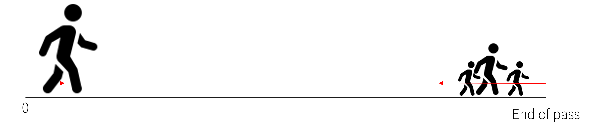
Now the process monopolizes the stride scheduler.
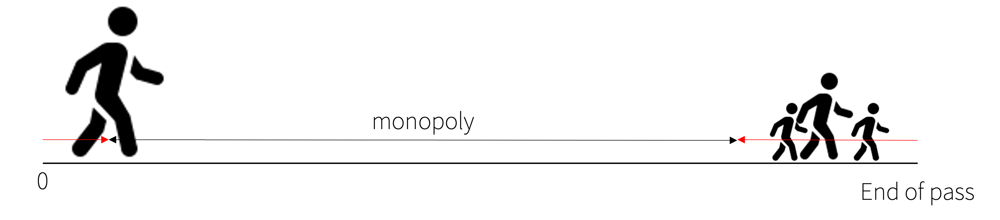
To prevent it, I put up a barrier. If a process tries to cross the barrier, then all processes return near the starting point maintaining the intervals.


```c
minpass = p == 0 || p->type == MLFQ ?
  ptable.mlfq.pass : p->pass;
if(minpass > BARRIER){
  for(i = 1; i <= ptable.stride.size; i++){
    ptable.stride.minheap[i]->pass -= minpass;
  }
  for(p = ptable.stride.run.head; p != 0; p = p->next){
    p->pass -= minpass;
  }
  ptable.mlfq.pass -= minpass;
}
```
### Early Priority Boost
MLFQ checks ticks. Every 100 ticks, priority boosting occurs. But in stride with mlfq scheduler, there can be a problem. Let's think of the case that one stride process has 80 tickets and mlfq has remain 20 tickets. While the stride process occupies a cpu for 80 ticks, mlfq occupies for 20 ticks. When it is 100th ticks turn, mlfq occurs priority boosting. But only 20 ticks have passed for mlfq. Not 100 ticks, it is 20 ticks. To sum it up, if mlfq uses the global ticks, it will occurs priority boosting early.

This problem can be solved with local ticks. MLFQ has the local ticks and the ticks increase only when the scheduler selected mlfq. Now the priority boosting only occurs if mlfq is selected 100 times.

```c
struct mlfq {
  uint ticks;
  ...
};
```
### Yield Systemcall of Stride
When a process invokes yield systemcall, the stride scheduler meets 2 crossroads. The one is to keep pass value and the other is to increase the pass value.

Let's think about this example: MLFQ, process A and B have same tickets. 

#### Way 1) Keep pass
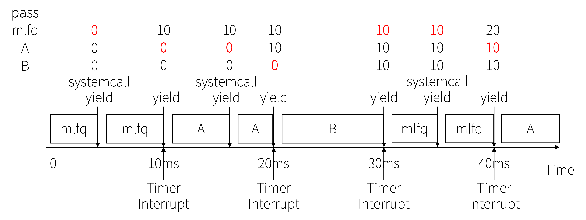
In this case, each process is guaranteed cpu time as much as the requested share. If it keeps own pass when invoking yield systemcall, then its yield will become useless. The intention of yield is giving up the cpu. But the process continues to occupy the cpu.

#### Way 2) Increase pass
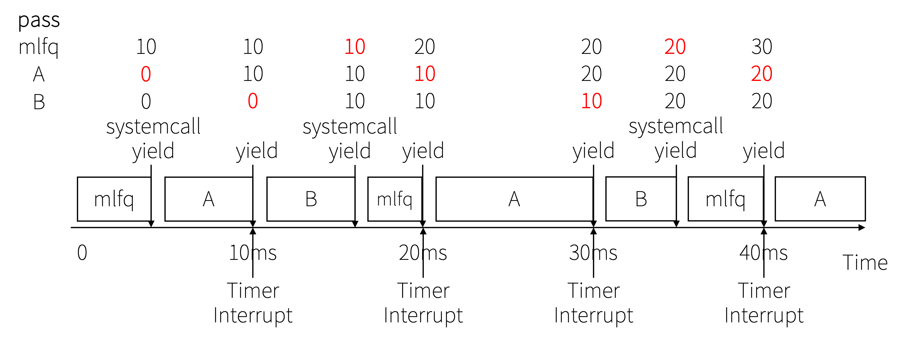
In this case, each process isn't guaranteed cpu time as much as the requested share. But the intent of the yield function is correctly reflected.

Because I thought the intention of process is more important than the actual cpu time, I designed on the second way. And anyway considering when a process sleeps, it is impossible to guarantee the exact cpu time.

# Performance
## Setup
```
Cloud Environment: Google Cloud Platform
Machine Type     : e2-medium
Virtualization   : kvm
Operating System : Ubuntu 18.04.6 LTS
Kernel           : Linux 5.4.0-1069-gcp
Architecture     : x86-64
QEMU             : version 2.11.1(Debian 1:2.11+dfsg-1ubuntu7.39)
```
### How to boot
`make CPUS=1 qemu-nox` (in ubuntu)

## Throughput Time
### How to run
`test_scheduler` (in xv6)
### Purpose
Check processes during the unit time (10s).
### Result
```
MLfQ(compute), cnt : 201791, lev[0] : 22153, lev[1] : 44737, lev[2] : 134901
MLfQ(compute), cnt : 361771
STRIDE(15%), cnt : 133016
STRIDE(5%), cnt : 44345
```
MLFQ has 80 tickets. And because 2 mlfq processes arrived at the same time and ran for the same time (10s), they occupied same share. So both processes were equivalent to having 40 tickets.

The time ratio for each process is as follows; 40% : 15% : 5% : 40%.
First process (MLFQ_LEVCNT) invokes lots of systemcall. But the others just increase the count. So let's compare the count value of the other processes; 133,016 : 44,345 : 361,771. The ratio is 3 : 1 : 8.16 which is similar with 15% : 5% : 40%. Last 8.16 is little bit high. Because the stride processes did more than just increasing the count; `set_cpu_share`.

## Running Time
### How to run
`time usertests` (in xv6)
### Purpose
Check the total running time of a process.

`usertests` is a stress test program of xv6. It executes lots of children processes and lots of I/O. There are lots of state transitions. So I chose this program to check the runtime.
### Variable
I set `NPROC` in param.h to various. And I compared with the original xv6.
### Result
| NPROC | Original xv6 | My design |
| ------ | ------ | ------ |
| 64 | 40.81s | 41.56s |
| 128 | 41.21s | 41.81s |
| 256 | 42.65s | 43.87s |
| 512 | 44.06s | 43.07s |
| 1024 | 47.35s | 44.08s |
| 2048 | 53.12s | 45.43s |
| 4096 | 58.42s | 45.19s |
| 8192 | 81.94s | 45.72s |
| 16384 | 234.92s | 45.02s |

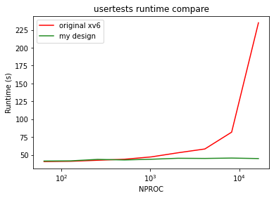

This result shows the power of reducing time complexity. And the scalability to the number of processes.

