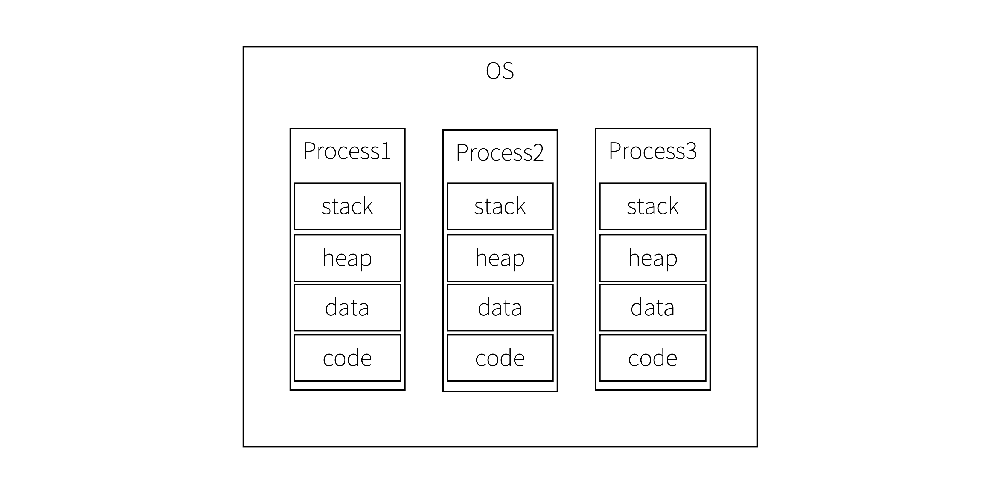
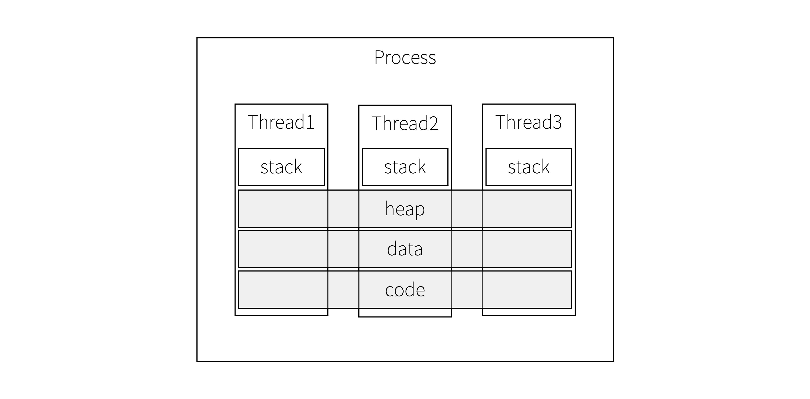
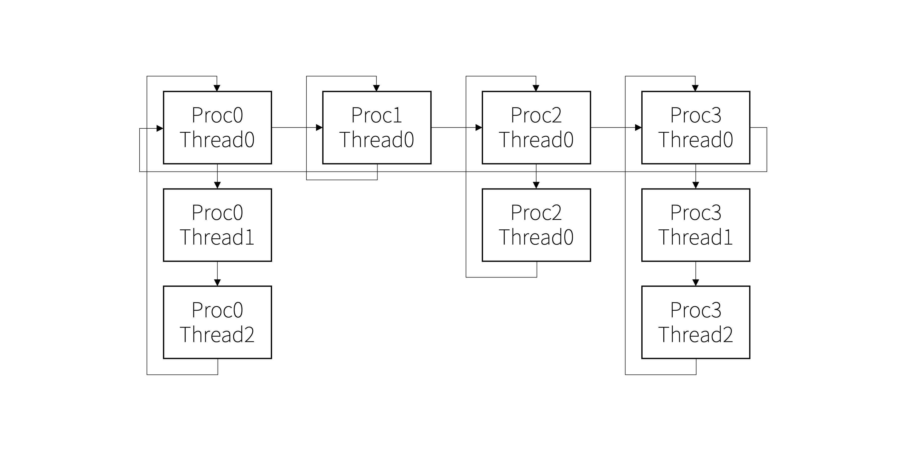

# Process/Thread
## Process
### Definition
- Running Program
- running unit in os


### Resources
Each process is guaranteed independent resources by HW virtualization.

### Context Switching
Context switching between processes guarantees the isolation of the address space. To ensure it, kernel has to change the page tables. It makes the cache hit rate low. So the performance becomes low. To sum up, it makes the memory safe but occurs performance degradation.

## Thread
### Definition
- Small running unit in the process


### Resources
Each thread shares resources of the process except for the stack.

### Context Switching
When switching context between threads, kernel doesn't change the address space. So it doesn't occur performance degradation. But because the threads share the address space, there can be memory access problems like race condition.

# POSIX thread
>POSIX Threads, commonly known as pthreads, is an execution model that exists independently from a language, as well as a parallel execution model. It allows a program to control multiple different flows of work that overlap in time. Each flow of work is referred to as a thread, and creation and control over these flows is achieved by making calls to the POSIX Threads API. POSIX Threads is an API defined by the standard POSIX.1c, Threads extensions (IEEE Std 1003.1c-1995).
## pthread_create
Create a thread.
### Declaration
```c
int pthread_create(pthread_t *thread, const pthread_attr_t *attr,
          void *(*start_routine)(void *),void *arg);
```
### Parameters
```
- pthread_t *thread             : [Out] thread identifier
- const pthread_attr_t *attr    : [In ] attributes of thread
- void *(*start_routine)(void *): [In ] entry function of thread
- void *arg                     : [In ] arguments of start_routine
```
### Return
On success, it returns 0. On error, it returns a non-zero value (error code).

## pthread_join
Wait a thread until it ends.
### Declaration
```c
int pthread_join(pthread_t thread, void **ret_val);
```
### Parameters
```
- pthread_t thread: [In ] thread identifier to wait
- void **ret_val  : [Out] return value of the thread
```
### Return
On success, it returns 0. On error, it returns a non-zero value (error code).

## pthread_exit
A thread exits.
```c
void pthread_exit(void *ret_val);
```
### Parameters
```
- void *ret_val: [In] return value of the thread
```

# Design Basic LWP Operations for xv6
## Milestone2
### Threaded Process

```c
struct proc {
  ...
  thread_t thread;
  struct proc *thread_next;
  void *retval;
};
```

### Yield
```
sched():
  get_main_thread(myproc())->ticks++
  if is_process_swich_turn():
    swtch(&p->context, mycpu()->scheduler)
  else if is_thread_switch_turn():
    struct proc *thread_next := select_next_thread()
    swtch(&p->context, thread_next->context)
```
### API
#### Create
`int thread_create(thread_t * thread, void * (*start_routine)(void *), void *arg);`
> You must provide a method to create threads within the process. From that point on, the execution routine assigned to each thread starts.

- Parameters
  - thread_t *thread: [Out] the thread id
  - void* (*start_routine)(void*): [In] entry point of the thread
  - void *arg: [In] an argument of start_routine

- Return

On success, this function returns 0. On error, it returns a non-zero value.

- Algorithm
```
thread_create(thread, start_routine, arg):
  struct proc *p := myproc()
  struct proc *th := allocproc()
  struct proc *thlast := select_last_thread(p)

  growproc(USTACKSIZE)

  for field in p:
    th->field = field
  th->thread = thlast->thread + 1
  *thread = th->thread
  thlast->thread_next = th
  th->thread_next = p
  th->parent = p

  sp := p->sz
  sp -= 4
  *sp = arg
  sp -= 4
  *sp = {return address}
  th->tf->esp = sp
  th->tf->eip = start_routine
```
I will supplement the return address part later.

#### Exit
`void thread_exit(void *retval);`
> You must provide a method to terminate the thread in it. As the main function do, you call the thread_exit function at the end of a thread routine. Through this function, you must be able to return a result of a thread. In xv6, when the program’s main function returns, the routine for safely exit is not includeed in the user stack. That is, in xv6, exit() must be explicitly called when the process is terminated. This is the same for threads. If you want to perform the test yourself, take this into account and explicitly call the thread_exit function at the point where the thread exits.

- Parameters
  - void *retval: [In] the return value of the thread

- Algorithm
```
thread_exit(retval):
  struct proc p := myproc()

  wakeup(p->parent)
  p->retval = retval
  p->state = ZOMBIE
  sched()
```

#### Join
`int thread_join(thread_t thread, void **retval);`
> You must provide a method to wait for the thread specified by the argument to terminate. If that thread has already terminated, then this returns immediately. In the join function, you have to clean up the resources allocated to the thread such as a page table, allocated memories and stacks. You can get the return value of a thread through this function.

- Parameters
  - thread_t thread: [In] id of the thread to join
  - void **retval: [Out] the return value of the thread which exited

- Return

On success, this function returns 0. On error, it returns a non-zero value.

- Algorithm
```
thread_join(thread, retval):
  struct proc p := myproc()
  struct proc *th := get_thread(p, thread)
  
  if th->state == ZOMBIE:
    *retval = th->retval
    freethread(th)
  else:
    sleep()
```

## Milestone3
### Interaction with system calls in xv6
0. wait
```
int
wait(void)
{
  ...
  for(;;){
    ...
    if(p->state == ZOMBIE){
      ...
      if(p->thread == 0)
        freeproc(p)
      else
        freethread(p)
      ...
    }
    ...
  }
}
```

1. exit
> When a LWP calls the exit system call, all LWPs are terminated and all resources used for each LWP must be cleaned up, and the kernel should be able to reuse it at a later point of time. Also, no LWP should survive for a long time after the exit system call is executed.
```
exit():
  struct proc *main := get_main_thread()

  close_all_open_files(main)
  wakeup1(main->parent);
  for child in main->children:
    child->parent = initproc
    if child->pid == main->pid && child->thread != 0:
      child->state = ZOMBIE
    if child->state == ZOMBIE:
      wakeup1(initproc)
  main->state = ZOMBIE
  sched()
```

2. fork
> Even if multiple LWPs call the fork system call at the same time, a new process must be created according to the fork’s behavior, and the address space of the LWP must be copied normally. You should also be able to wait for the child process normally by the wait system call. Note the parent-child relationship between processes after the fork.

When `fork` is called, I will fork every threads including main thread and sub threads. New threads have a new shared address space. Problem is how to create just one process. I cannot solve it yet, but I will supplement it later.

3. exec
> If you call the exec system call, the resources of all LWPs are cleaned up so that the image of another program can be loaded and executed normally in one LWP. At this time, the process executed by the exec must be guaranteed to be executed as a general process thereafter.
```
exec(char *path, char **argv):
  struct proc *main := get_main_thread()
  for th in main->threads:
    if th->thread != myproc()->thread:
      th->parent = initproc
      th->state = ZOMBIE
      wakeup1(initproc)
  original_exec(path, argv)
  myproc()->thread = 0
```
4. sbrk
> When multiple LWPs simultaneously call the sbrk system call to extend the memory area, memory areas must not be allocated to overlap with each other, nor should they be allocated a space of a different size from the requested size. The expanded memory area must be shared among LWPs.

`sbrk` uses `growproc`. So I will modify the `growproc`. And not to overlap the allocated memory, I will use lock. It guarantees the atomic memory allocation. And after `growproc`, every threads in a process will have same `sz`. It guarantees non-overlap of the allocated memory.

5. kill
> If more than one LWP is killed, all LWPs must be terminated and the resources for each LWPs in that process must be cleaned up. After a kill for a LWP is called, no LWP in that group should survive for a long time.
```c
int
kill(int pid)
{
  struct proc *p;

  acquire(&ptable.lock);
  for(p = ptable.proc; p < &ptable.proc[NPROC]; p++){
    if(p->pid == pid){
      p->killed = 1;
      // Wake process from sleep if necessary.
      if(p->state == SLEEPING){
        list_del(&p->queue);
        p->state = RUNNABLE;
        if(p->type == MLFQ)
          enqueue(p->privlevel, p);
      }
      release(&ptable.lock);
      return 0;
    }
  }
  release(&ptable.lock);
  return -1;
}
```
Every threads have same pid. So there is no need to modify the code.

6. pipe
> All LWPs must share a pipe, and reading or writing data should be synchronized and not be duplicated.

I think `proc->ofile` decides the pipe. And in the original fork, there is a part to copy the resources. But I don't know whether `file->ref` increases or not in `thread_create`. After the lab class, I will decide it.
```c
for(i = 0; i < NOFILE; i++)
  if(curproc->ofile[i])
    np->ofile[i] = filedup(curproc->ofile[i]); // case 1: increase ref
    np->ofile[i] = curporc->ofile[I];          // case 2: keep ref
```

7. sleep
> When a specific LWP executes a sleep system call, only the requested LWP should be sleeping for the requested time. If a LWP is terminated, the sleeping LWP should also be terminated.

I think that sleeping of the thread is not different from sleeping of the process. And if a LWP is terminated in exit, well defined threaded exit will make the sleeping LWP is also terminated.

8. nested thread

I will test the nested thread later.

### Interaction with the schedulers that you implemented in Project 1: MLFQ and Stride
#### MLFQ
1. Change parameters (MACRO)

```
#define BOOSTINTERVAL 100 -> 200
#define TQ(l) (l==0 ? 5 : 10*l)
#define TA(l) (4*TQ(l))
```

2. Change increasing ticks

At project1, the place where `ticks` increases is `scheduler`. But the scheduling between threads doesn't occur in the scheduler. So the place should be changed. I will change the part to `sched`. And `ticks` of a process is `ticks` of the main thread. Every threads refer the `ticks` of the main thread.

3. thread_create

If a mlfq thread calls `thread_create`, the new RUNNABLE thread has to be pushed to the highest queue.

#### Stride
1. Default time quantum: 5ticks

[`sched`](#yield) checks time quantum. So there is no needs to modification in the stride scheduler about the ticks.

2. thread_create

If a stride thread calls `thread_create`, the new RUNNABLE thread has to be pushed to minheap.

3. set_cpu_share

> All threads belonging to the same process are scheduled by the same scheduler. Threads in Stride and MLFQ scheduler share the time slice of their origin process.

When a mlfq thread calls 'set_cpu_share`, all threads in the process have to be stride threads. And they keeps their ticks.