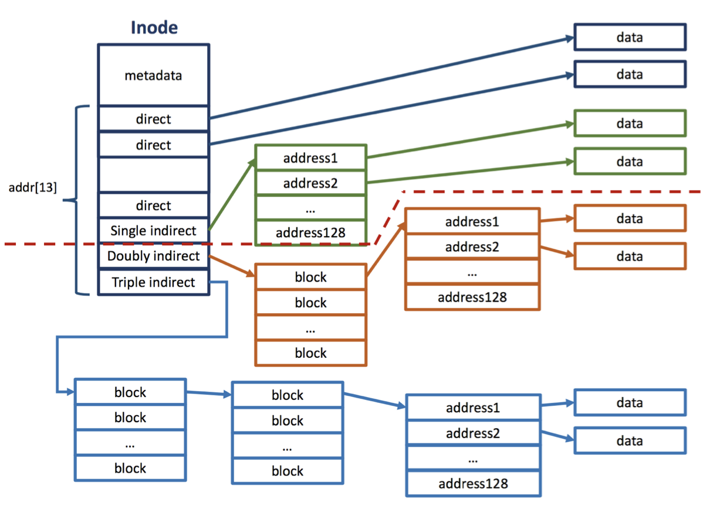

# Introduction
The filesystem of the original xv6 supports files of which size is less than 70KiB. But there are lots of big files which is larger than 70KiB nowadays. We wanted to store the big files. This project is for expanding the file size.

## Goal
Expand the maximum size of a file.

## Filesystem
In the original xv6 filesystem, an inode has 12 direct locations and an indirect location. And the indirect location points a block has 128 locations. So total 140 locations, an inode can have. And a location points to a block. Because a block is 512 bytes, a file can have maximum 140 * 512bytes (70KiB).

I expanded the supported file size by adding indirect pointers. And the first indirect pointer is a single indirect pointer which points a block has 128 locations. Then the second indirect pointer is a doubly indirect pointer which points a block which points a block again. And the last indirect pointer is a triple indirect pointer.


# Design
## Data Structure
```c
#define NDIRECT 10
#define NINDIRECT (BSIZE/sizeof(uint))
#define NINDIRECT2 (NINDIRECT*NINDIRECT)
#define NINDIRECT3 (NINDIRECT*NINDIRECT*NINDIRECT)
#define __MAXFILE1 (NDIRECT + NINDIRECT + NINDIRECT2 + NINDIRECT3)
#define __MAXFILE2 (FSSIZE * 0.9)
#define MAXFILE  ((__MAXFILE1) < (__MAXFILE2) ? (__MAXFILE1) : (__MAXFILE2))

// On-disk inode structure
struct dinode {
  short type;           // File type
  short major;          // Major device number (T_DEV only)
  short minor;          // Minor device number (T_DEV only)
  short nlink;          // Number of links to inode in file system
  uint size;            // Size of file (bytes)
  uint addrs[NDIRECT+3];   // Data block addresses
};
```
The direct addresses size is reduced to 10.
And remain 3 addresses are for each indirect addresses.

#### 1. addrs[NDIRECT]
It can point total `NINDIRECT` blocks.
#### 2. addrs[NDIRECT+1]
It can point total `NINDIRECT2` blocks.
#### 3. addrs[NDIRECT+2]
It can point total `NINDIRECT3` blocks.

And the maximum number of blocks for a file is 2,113,674.

`NDIRECT + NINDIRECT + NINDIRECT2 + NINDIRECT3`

But the size of file system in blocks (`FSSIZE` in param.h) is set 40,000. So it cannot fully support the size. So I bounded the maximum.

## bmap
```
bmap(struct inode *ip, uint bn):
  if bn < NDIRECT:
    return ip->addrs[bn]
  bn -= NDIRECT
  else if bn < NINDIRECT:
    return block(ip->addrs[NDIRECT])
  bn -= NINDIRECT
  else if bn < NINDIRECT2:
    return block(block(ip->addrs[NDIRECT+1]))
  bn -= NINDIRECT2
  else if bn < NINDIRECT3:
    return block(block(block(ip->addrs[NDIRECT+2])))
```
It returns the disk block address which the block number points. The block can be on the direct, single indirect, doubly indirect or triple indirect block. So according to the type of the block, it searches the address of the block.

## itrunc
```
itrunc(struct inode *ip):
  for addr in ip->addrs[0:NDIRECT]:
    bfree(addr)
  if ip->addrs[NDIRECT]:
    for addr in block(ip->addrs[NDIRECT]):
      bfree(addr)
    bfree(ip->addrs[NDIRECT])
  if ip->addrs[NDIRECT+1]:
    for addr in block(ip->addrs[NDIRECT+1]):
      for addr2 in block(addr):
        bfree(addr2)
      bfree(addr)
    bfree(ip->addrs[NDIRECT+1])
  if ip->addrs[NDIRECT+2]:
    for addr in block(ip->addrs[NDIRECT+2]):
      for addr2 in block(addr):
        for addr3 in block(addr2):
          bfree(addr3)
        bfree(addr2)
      bfree(addr)
    bfree(ip->addrs[NDIRECT+2])
```
It deletes blocks with depth-first search algorithm from the direct to the triple indirect.

# Evaluation
## Setup
```
Cloud Environment: Google Cloud Platform
Machine Type     : e2-medium (2 vCPU)
Virtualization   : kvm
Operating System : Ubuntu 18.04.6 LTS
Kernel           : Linux 5.4.0-1069-gcp
Architecture     : x86-64
QEMU             : version 2.11.1(Debian 1:2.11+dfsg-1ubuntu7.39)
```
## test_bigrw
### Description
```
do 4 times:
  open file in write mode
  write 16MB
  close file
  open file in read mode
  read 16MB
  test contents
  close file
  remove file
```
The total writing size is 64 Mbytes.

### How to boot
`make CPUS=1 qemu-nox` (in ubuntu)

### How to run
`test_bigrw` (in xv6)

### Result
```
[0] create test_bigfile
    write 16 MB pass.
    read 16 MB pass.
[0] rm test_bigfile
[1] create test_bigfile
    write 16 MB pass.
    read 16 MB pass.
[1] rm test_bigfile
[2] create test_bigfile
    write 16 MB pass.
    read 16 MB pass.
[2] rm test_bigfile
[3] create test_bigfile
    write 16 MB pass.
    read 16 MB pass.
[3] rm test_bigfile
```
### Analysis
Original xv6 cannot create a file which is larger than 70KiB. But the xv6 of this project can create a 16 MB file. And it can create and delete big files clearly.