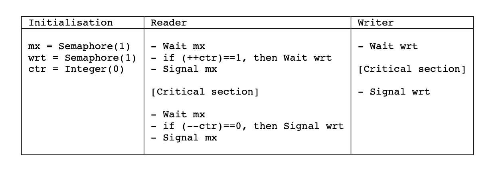
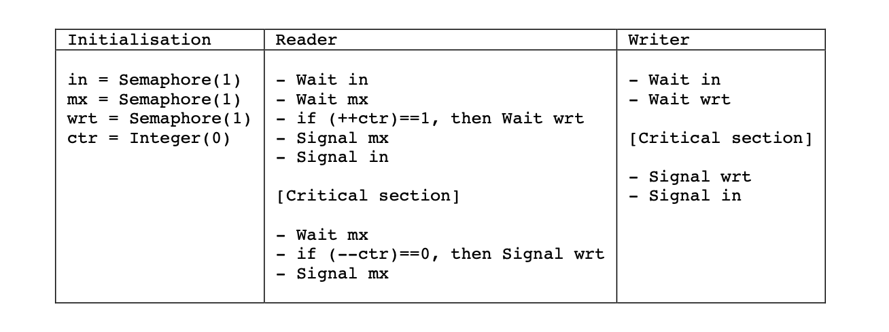
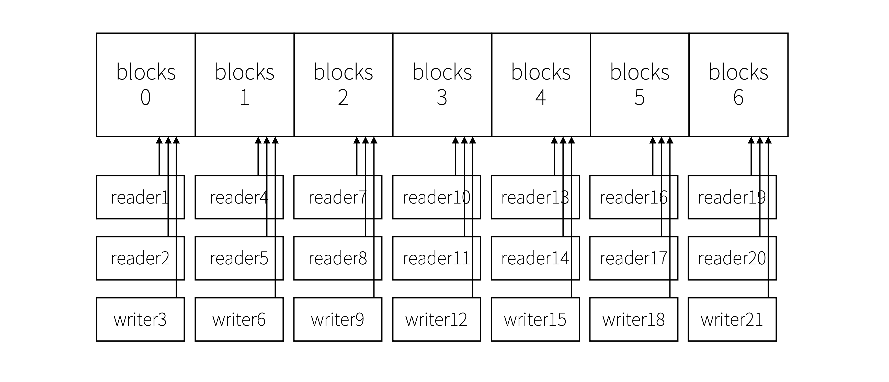

# Introduction
## Thread File RW API
Read and write systemcalls are not suitable for multi-threading. When they are called, the internal offset moves. A race condition for the offset can occur. So we need to implement thread-suitable read&write.

## Goals
1. Implement the pread, pwrite systemcall
2. Implement a thread-safe read and write user library
# Design
## Systemcalls
### pwrite
#### Prototype
`int pwrite(int fd, void* buf, int n, int off);`
#### Description
**pwrite()** writes up to `n` bytes from the buffer starting at `buf` to the file descriptor `fd` at offset `off`. The file offset is not changed.
#### Implementation
```c
// Previous version
int filewrite(struct file *f, char *addr, int n);
// This project version
int filewrite(struct file *f, char *addr, int n, int off);
```
I added `off` parameter to `filewrite`. If this parameter is less than 0, then this function will write like the previous version. Otherwise, it will write from `off`.

The original `write` sets `off` as a negative number, but `pwrite` sets `off` as the systemcall argument `off`.

Look at the below:
```c
int sys_write(void)
{
  ...
  return filewrite(f, p, n, -1);
}
int sys_pwrite(void)
{
  ...
  return filewrite(f, p, n, off);
}
```

### pread
#### Prototype
`int pread(int fd, void* buf, int n, int off);`
#### Description
**pread()** reads up to `n` bytes from file descriptor `fd` at offset `off` (from the start of the file) into the buffer starting at `buf`. The file offset is not changed.
#### Implementation
The mechanism is same with pwrite. `off` parameter is added to `fileread`. When the argument of offset is less than 0, it reads from the offset. But when the argument is 0 or more than 0, it reads with the internal offset of the file descriptor.

## Thread-safe RW
### 1. thread_safe_guard
#### Prototype
`thread_safe_guard`
#### Description
Thread safety is guaranteed through the thread_safe_guard structure. This structure is allocated by the same descriptor within the process.
#### Implementation
```c
typedef struct {
  int fd;
  rwlock_t lock;
} thread_safe_guard;
```
### 2. init
#### Prototype
`thread_safe_guard* thread_safe_guard_init(int fd);`
#### Description
The **thread_safe_guard_init** function allocates a thread_safe_guard structure and maps the allocated structure with the file descriptor received as a parameter. Then, the the address of this structure is returned.
#### Implementation
```
thread_safe_guard_init(int fd):
  guard = malloc(sizeof(thread_safe_guard))
  guard->fd = fd
  rwlock_init(&guard->lock)
  return guard
```
### 3. read
#### Prototype
`int thread_safe_pread(thread_safe_guard *file_guard, void *addr, int n, int off);`
#### Description
The **thread_safe_pread** function uses the address of thread_safe_guard returned from the thread_safe_guard_init function. By using this, this function can identify the file to be read. The first variable of this function, `file_guard`, means the address of the guard allocated by the thread_safe_guard_init function. The second variable, `addr`, is the address of the memory from which to read the file. The third variable, `n`, means the number of bytes of data to read. The fourth variable, `off`, means the location of the data to be read within the file, that is, the offset of the data. And the return value is the size of the read data.
#### Implementation
```
thread_safe_pread(thread_safe_guard *file_guard, void *addr, int n, int off):
  rwlock_acquire_readlock(&file_guard->lock)
  result = pread(file_guard->fd, addr, n, off)
  rwlock_release_readlock(&file_guard->lock)
  return result
```
### 4. write
#### Prototype
`int thread_safe_pwrite(thread_safe_guard *file_guard, void *addr, int n, int off);`
#### Description
The **thread_safe_pwrite** function uses the address of thread_safe_guard returned from the thread_safe_guard_init function. By using this, this function can identify the file to be written. The first variable of this function, `file_guard`, means the address of the guard allocated by the thread_safe_guard_init function. The second variable, `addr`, is the address of the memory where the content to be written is located. The third variable, `n`, means the number of bytes of data to be written. The fourth variable, `off`, is where the data will be written on storage.
#### Implementation
```
thread_safe_pwrite(thread_safe_guard *file_guard, void *addr, int n, int off):
  rwlock_acquire_readlock(&file_guard->lock)
  result = pwrite(file_guard->fd, addr, n, off)
  rwlock_release_readlock(&file_guard->lock)
  return result
```
### 5. destroy
#### Prototype
`void thread_safe_guard_destroy(thread_safe_guard *file_guard);`
#### Description
The **thread_safe_guard_destroy** function deletes the thread_safe_guard structure allocated from the thread_safe_guard_init function. To do this, it receives the address of the thread_safe_guard structure allocated as a parameter, and uses this address to destroy the previously allocated thread_safe_guard structure.

#### Implementation
```
thread_safe_guard_destroy(thread_safe_guard *file_guard):
  free(file_guard)
```
## Improved Readers-writer lock
### Project specification
> Different reads of overlapping areas should be performed without waits. However, if a write is performed on the overlapping area, this operation must wait the previously performed reads or writes operations, and subsequent read and write operations on the same area must also wait for this write operation.
### Writer Starvation
The readers-writer lock of project3 had the writer starvation problem. But the problem is not allowed in this project. So I solved it.

Project3 rwlock had a logic like below.


But the improved rwlock was implemented according to the below algorithm.


[reference](https://arxiv.org/pdf/1309.4507.pdf)

# Evaluation
## Setup
```
Cloud Environment: Google Cloud Platform
Machine Type     : e2-medium (2 vCPU)
Virtualization   : kvm
Operating System : Ubuntu 18.04.6 LTS
Kernel           : Linux 5.4.0-1069-gcp
Architecture     : x86-64
QEMU             : version 2.11.1(Debian 1:2.11+dfsg-1ubuntu7.39)
```
## test_prw
### Description


Each group has 1 writer and several readers. Some blocks are assigned to the group. And the blocks aren't overlapped with the blocks of another group. And the writer of a group writes to the assigned blocks. And the other readers read them.

### How to boot
`make CPUS=2 qemu-nox` (in ubuntu)

I tested it with 2 CPUs.

### How to run
1. `test_prw` (in xv6)

2. `cat testfile` (in xv6)

### Result
#### test_prw output
```
[2] pread finish
[5] pread finish
[3] pread finish
[6] pwrite finish
[7] pread finish
[9] pread finish
[10] pread finish
[11] pread finish
[8] pread finish
[12] pwrite finish
[13] pread finish
[14] pread finish
[15] pread finish
[16] pread finish
[17] pread finish
[18] pwrite finish
[19] pread finish
[20] pread finish
[21] pread finish
[22] pread finish
[23] pread finish
[24] pwrite finish
[25] pread finish
[26] pread finish
[27] pread finish
...
```
#### cat output
```
  [ 6] changed
->[ 6] changed
  [12] changed
->[12] changed
  [18] changed
->[18] changed
  [24] changed
->[24] changed
  [30] changed
->[30] changed
  [36] changed
->[36] changed
  [42] changed
->[42] changed
  [48] changed
->[48] changed
```

### Analysis
#### Correctness: good
Threads can read and write correctly.

#### Fairness: good
The order of reads and writes is guaranteed.

#### Performance: good
Readers can read in parallel.